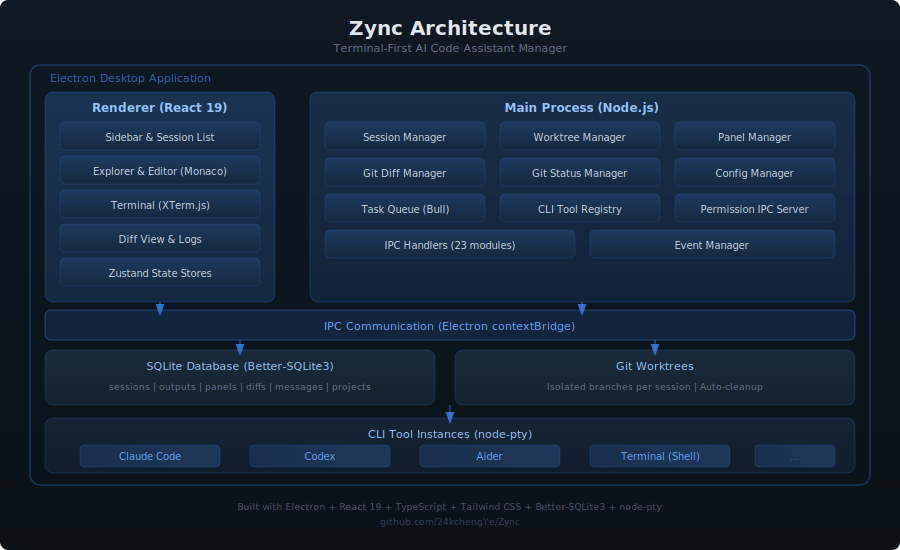
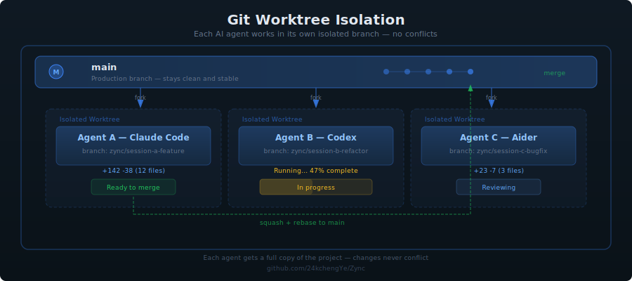
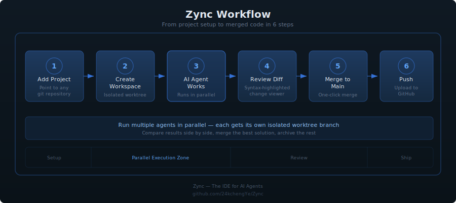
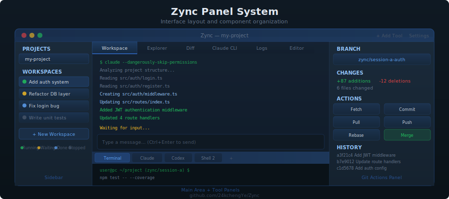
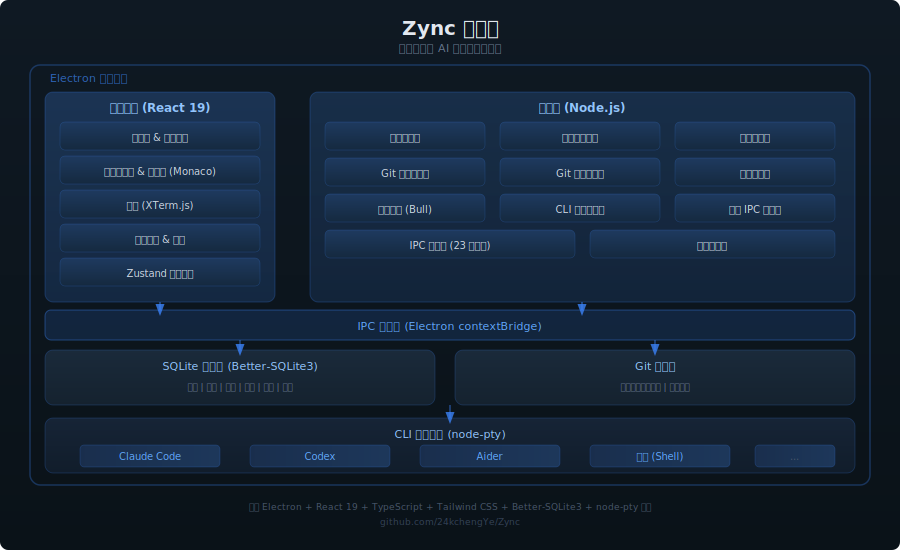
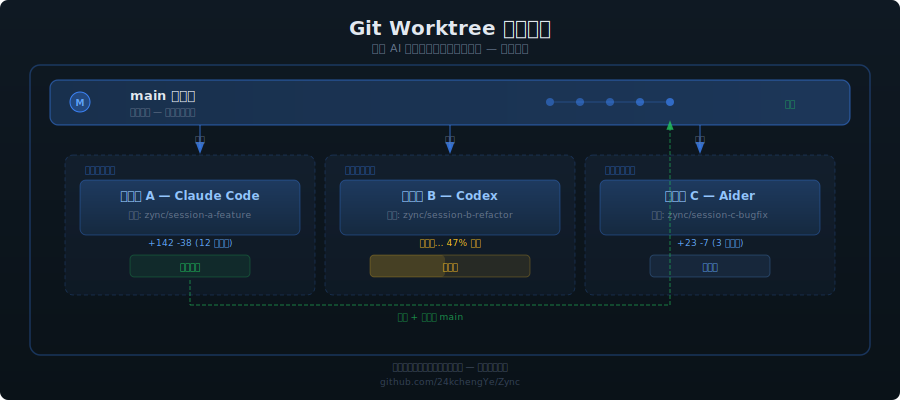
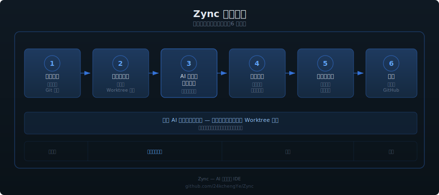
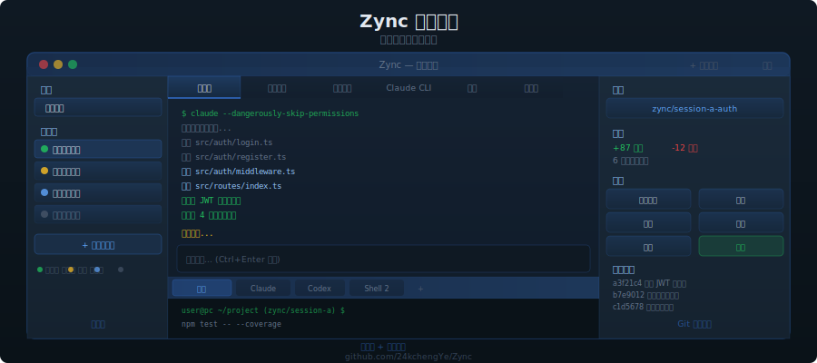

<p align="center">
  
</p>

<h1 align="center">Zync</h1>

<p align="center">
  <strong>The IDE for AI Agents</strong><br/>
  Run multiple Claude Code, Codex, or Aider sessions in parallel — each in its own isolated git worktree.
</p>

<p align="center">
  <a href="https://github.com/24kchengYe/Zync/releases"></a>
  <a href="https://github.com/24kchengYe/Zync/blob/main/LICENSE"></a>
  <a href="https://github.com/24kchengYe/Zync/stargazers"></a>
  
</p>

<p align="center">
  <a href="#quick-start">Quick Start</a> · <a href="#features">Features</a> · <a href="#contributing">Contributing</a> · [English](#why-zync) | [中文](#为什么需要-zync)
</p>

---

<p align="center">
  
</p>

<p align="center">
  <em>Three Claude Code agents working on different tasks simultaneously, each in its own worktree.</em>
</p>

<p align="center">
  
</p>

<p align="center">
  <em>Review what each agent changed before merging back to main.</em>
</p>

## Why Zync?

You open a terminal, start Claude Code, give it a task, and... wait. You want to try a different approach at the same time? Now you need a second terminal, a second branch, and the discipline to keep them from editing the same files. By the third agent, you're drowning in tabs and merge conflicts.

**Zync fixes this.** Every session gets its own git worktree automatically. You see all your agents in one sidebar — who's running, who's done, who needs input. When an agent finishes, you review the diff and merge with one click. No manual branching. No conflicts. No alt-tabbing.

<table>
<tr>
<td width="50%">

**Without Zync**
- One agent at a time, or messy conflicts
- Manual `git worktree add` / cleanup
- Alt-tabbing between terminals
- Running `git diff` by hand to review changes
- No idea which agent needs your attention

</td>
<td width="50%">

**With Zync**
- 10+ agents working in parallel
- Automatic worktree isolation per session
- Single dashboard for all agents
- Built-in syntax-highlighted diff viewer
- Notifications when agents finish or need input

</td>
</tr>
</table>

## Quick Start

### Prerequisites

- [Node.js](https://nodejs.org/) >= 22.14.0, [pnpm](https://pnpm.io/) >= 8, [Git](https://git-scm.com/)
- At least one AI agent: [Claude Code](https://docs.anthropic.com/en/docs/claude-code), [Codex](https://github.com/openai/codex), or [Aider](https://aider.chat/)

### Install & Launch

```bash
git clone https://github.com/24kchengYe/Zync.git
cd Zync
pnpm install && pnpm run setup
```

**Option A — One-click (Windows):**

Copy `start.bat.example` to `start.bat`, edit your settings, double-click to launch.

**Option B — Manual (all platforms):**

```bash
# Terminal 1: start frontend
pnpm run --filter frontend dev

# Terminal 2: start app (after frontend shows "ready")
npx electron .
```

### Build Installers

```bash
pnpm run build:win:x64    # Windows
pnpm run build:mac         # macOS (universal)
pnpm run build:linux       # Linux (deb + AppImage)
```

## Features

<table>
<tr>
<td width="50%" valign="top">

### Parallel Agent Sessions
Run Claude Code, Codex, Aider, Goose, or any CLI tool — multiple instances at once. Each gets its own git worktree so agents never conflict.

</td>
<td width="50%" valign="top">

### Built-in Diff Viewer
See exactly what each agent changed with syntax highlighting. Compare against main, review commits, and decide what to keep.

</td>
</tr>
<tr>
<td width="50%" valign="top">

### Permission Control
**Fast & Flexible** — auto-approve everything for trusted workflows.<br/>
**Secure & Controlled** — review each action before it runs.

</td>
<td width="50%" valign="top">

### Full Git Workflow
Fetch, commit, pull, push, stash, rebase from main, merge to main — all from the sidebar. No terminal needed.

</td>
</tr>
<tr>
<td width="50%" valign="top">

### Smart Notifications
Desktop alerts when an agent finishes, hits an error, or needs your input. Never miss a prompt again.

</td>
<td width="50%" valign="top">

### Multi-Tool Support
Native integration for Claude Code and Codex. Add Aider, Goose, or any CLI tool via custom commands.

</td>
</tr>
</table>

<p align="center">
  
</p>
<p align="center"><em>Create a workspace: pick your agent, set permissions, write your prompt.</em></p>

## How It Works

```
You create a session with a prompt
         │
         ▼
Zync creates an isolated git worktree + branch
         │
         ▼
AI agent runs in that worktree (no conflicts with other sessions)
         │
         ▼
You review the diff, then merge to main or archive
```

### Architecture

<p align="center">
  
</p>

### Worktree Isolation

<p align="center">
  
</p>

<details>
<summary>More diagrams (Workflow, Panel System, Chinese versions)</summary>

**Workflow:**
<p align="center">
  
</p>

**Panel System:**
<p align="center">
  
</p>

**中文图表 / Chinese Diagrams:**
<p align="center">
  <br/><br/>
  <br/><br/>
  <br/><br/>
  
</p>

</details>

## Configuration

**Smart workspace naming** — Zync can auto-name sessions using AI. Set these in `start.bat` or your environment:

```bash
OPENAI_API_KEY=your-openrouter-key
OPENAI_BASE_URL=https://openrouter.ai/api/v1
OPENAI_MODEL=anthropic/claude-haiku-4-5
```

**Settings** (`Ctrl + ,`): Theme (Light/Dark/OLED), UI scale, terminal shell, security mode, custom Claude path, notification preferences.

**Keyboard shortcuts**: `Ctrl+K` command palette, `Ctrl+N` new workspace, `Ctrl+B` toggle sidebar, `Ctrl+Enter` send to AI. Full list in the app's Help dialog (`?` button).

## Known Limitations

Zync orchestrates AI agents. It does not replace your IDE.

- **No code editor** — use VS Code or PyCharm for editing. Zync has an "Open in IDE" button for every workspace.
- **No debugger, no LSP, no plugins** — those live in your IDE. Zync focuses on the agent workflow layer.

These are intentional. Zync does one thing well.

## Contributing

We'd love help. Some areas where contributions are especially welcome:

- Performance optimization for large projects (Explorer, Diff)
- Plugin system for custom agent integrations
- Workspace templates (pre-configured agent + prompt combos)
- Session statistics dashboard (tokens, time, cost)
- i18n / localization support

Found a bug or have an idea? [Open an issue](https://github.com/24kchengYe/Zync/issues). PRs welcome — see [CONTRIBUTING.md](CONTRIBUTING.md) for guidelines.

## Changelog

### v1.0.0 (2026-03-15)

**Core:**
- Windows Permission IPC server using named pipes
- Security mode (approve/ignore) works correctly across all code paths
- Permission mode selector in workspace creation dialog
- Permanent delete for archived workspaces
- Uses global Claude Code installation (statusline support)
- Claude Code manages its own sessions natively
- Diff caching with SHA-1 fingerprint-based invalidation

**Editor:**
- Multi-file tab bar with cached state per file
- Image/PDF/video/audio preview in Explorer
- LaTeX compile & preview with draggable split view (Ctrl+S auto-compile)
- Python/JS/TS/Shell script execution with output panel

**UX:**
- Git action descriptions (Fetch, Stash, Rebase, Merge, etc.)
- "New Workspace" terminology unification
- Settings dropdowns no longer close the dialog
- DevTools toggle button in toolbar
- Chinese path support (chcp 65001 UTF-8 codepage)
- OpenRouter support for smart workspace naming
- Chinese user guide (GUIDE_CN.md)

**Fixes:**
- Modal overflow clipping dropdown menus
- Permission mode not passed from creation dialog to CLI
- Delete button missing from archived workspaces
- PTY terminal type corrected to xterm-256color
- node_modules excluded from terminal PATH

## Documentation

- [中文使用指南 / Chinese Guide](GUIDE_CN.md)
- [Adding New CLI Tools](docs/ADDING_NEW_CLI_TOOLS.md)
- [Implementing New CLI Agents](docs/IMPLEMENTING_NEW_CLI_AGENTS.md)
- [Building on Windows](docs/BUILDING_ON_WINDOWS.md)
- [Setup Troubleshooting](docs/troubleshooting/SETUP_TROUBLESHOOTING.md)
- [Database Schema](docs/DATABASE_DOCUMENTATION.md)

---

<div align="center">

# Zync 中文文档

**面向 AI 编程代理的 IDE。**

*并行运行多个 Claude Code、Codex 或 Aider 会话——每个都在独立的 git worktree 中工作。*

</div>

## 为什么需要 Zync？

你一定经历过——

打开终端，启动 Claude Code，给它一个任务，然后……等。想同时试另一种方案？你需要第二个终端、第二个分支，还得小心别让两个 Agent 改同一个文件。到第三个 Agent 的时候，你已经淹没在标签页和合并冲突里了。

**Zync 解决了这个问题。** 每个会话自动获得独立的 git worktree。你在一个侧边栏里看到所有 Agent——谁在跑、谁做完了、谁在等你输入。Agent 完成后，你审查 diff 然后一键合并。不用手动建分支，不会有冲突，不用 Alt-Tab 切来切去。

<table>
<tr>
<td width="50%">

**没有 Zync**
- 一次只能跑一个 Agent，或者冲突满天飞
- 手动 `git worktree add` / 清理
- 在终端之间 Alt-Tab 切换
- 手动跑 `git diff` 审查改动
- 不知道哪个 Agent 需要你的注意

</td>
<td width="50%">

**有了 Zync**
- 10+ 个 Agent 并行工作
- 每个会话自动隔离 worktree
- 统一的 Agent 管理面板
- 内置语法高亮 diff 查看器
- Agent 完成或需要输入时桌面通知

</td>
</tr>
</table>

## 快速开始

**前置条件：** [Node.js](https://nodejs.org/) >= 22.14.0、[pnpm](https://pnpm.io/) >= 8、[Git](https://git-scm.com/)，以及至少一个 AI Agent（[Claude Code](https://docs.anthropic.com/en/docs/claude-code)、[Codex](https://github.com/openai/codex) 或 [Aider](https://aider.chat/)）

```bash
git clone https://github.com/24kchengYe/Zync.git
cd Zync
pnpm install && pnpm run setup
```

**Windows 一键启动：** 复制 `start.bat.example` 为 `start.bat`，编辑配置，双击运行。

**手动启动：**
```bash
# 终端 1：启动前端
pnpm run --filter frontend dev

# 终端 2：启动应用（等前端显示 ready 后）
npx electron .
```

## 核心功能

| 功能 | 说明 |
|------|------|
| **并行 Agent 会话** | 同时运行 Claude Code、Codex、Aider 等，互不干扰 |
| **内置 Diff 查看器** | 语法高亮显示每个 Agent 的改动，支持缓存加速 |
| **权限控制** | 每个工作区独立选择：自动批准 或 手动审批 |
| **完整 Git 工作流** | Fetch、Commit、Pull、Push、Rebase、Merge，侧边栏一键操作 |
| **智能通知** | Agent 完成、出错或等待输入时桌面提醒 |
| **多工具支持** | Claude Code 和 Codex 原生集成，其他工具通过自定义命令添加 |
| **文件预览** | Explorer 支持图片、PDF、视频、音频预览 |
| **多标签编辑** | 同时打开多个文件，标签栏切换 |
| **LaTeX 编译** | 内置编译预览，Ctrl+S 自动编译，可拖动分栏 |
| **脚本执行** | Python/JS/TS/Shell 文件一键运行 |

## 平台支持

| 平台 | 状态 | 说明 |
|------|------|------|
| **Windows** | 完整支持 | Named Pipe 权限 IPC、中文路径支持 |
| **macOS** | 完整支持 | Universal 二进制（Intel + Apple Silicon） |
| **Linux** | 完整支持 | deb 和 AppImage 包 |

## 已知限制

Zync 专注于 AI Agent 编排，**不替代你的 IDE**：
- **没有代码编辑器** — 用 VS Code 或 PyCharm 编辑，Zync 有"Open in IDE"按钮
- **没有调试器、LSP、插件** — 这些在你的 IDE 里，Zync 专注于 Agent 工作流层

详细使用说明请看 [中文使用指南](GUIDE_CN.md)。

---

## License

AGPL-3.0 — See [LICENSE](LICENSE)

---


[](https://star-history.com/#24kchengYe/Zync&Date)
