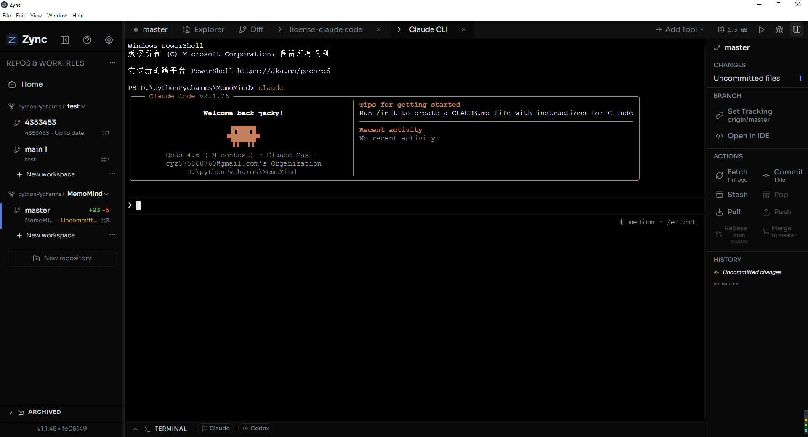
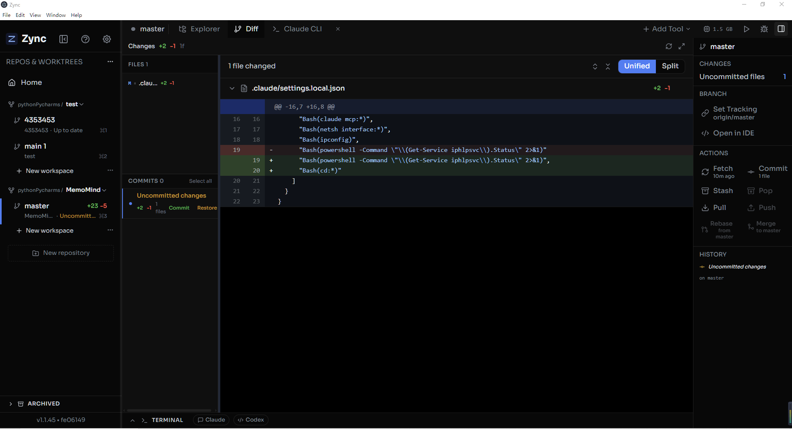
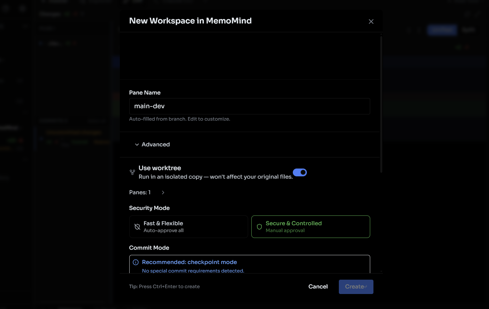

<p align="center">
  
</p>

<h1 align="center">Zync</h1>

<p align="center">
  <strong>The IDE for AI Agents</strong> — Orchestrate Claude Code, Codex, Aider, and more in parallel.
</p>

<p align="center">
  <a href="https://github.com/24kchengYe/Zync/stargazers"></a>
  <a href="https://github.com/24kchengYe/Zync/network/members"></a>
  <a href="https://github.com/24kchengYe/Zync/blob/main/LICENSE"></a>
  <a href="https://github.com/24kchengYe/Zync/releases"></a>
</p>

<p align="center">
  While VS Code and PyCharm are built for humans who write code,<br/>
  <strong>Zync is built for humans who manage AI agents that write code.</strong>
</p>

<p align="center">
  <strong>If Zync helps your workflow, please consider giving it a <a href="https://github.com/24kchengYe/Zync/stargazers">Star</a>!</strong>
</p>

## The Problem

If you've tried running AI coding agents in VS Code or a regular terminal, you've hit these walls:

**1. One agent at a time.** You give Claude Code a task, then sit and wait. Want to try a different approach? You have to stop the first one, lose its context, and start over. You can't easily compare two solutions side by side.

**2. Agents step on each other's toes.** Open two terminals and run two agents on the same project — they both edit the same files, create merge conflicts, and break each other's work. You spend more time untangling the mess than reviewing the code.

**3. No easy way to review and roll back.** Your agent made 47 file changes. Which ones are good? Which ones broke something? In a terminal, you're running `git diff` manually. In VS Code, the source control panel wasn't designed for reviewing AI-generated bulk changes across branches.

**4. Branching is manual and tedious.** The proper way to isolate parallel work is git worktrees — but creating, managing, and cleaning them up by hand is painful. Most people don't bother, and end up with agents fighting over the same working directory.

**5. No unified view.** With multiple agents across multiple terminals, you're alt-tabbing constantly. There's no single dashboard showing "Agent A is done, Agent B is still running, Agent C needs input."

## How Zync Solves This

Zync handles all of the above automatically:

- **Parallel execution** — Run 10+ AI agents simultaneously, each working on a different task
- **Automatic isolation** — Every agent gets its own git worktree. No conflicts, no mess
- **Built-in diff viewer** — See exactly what each agent changed, with syntax highlighting
- **One-click merge** — Happy with an agent's work? Merge it back to main. Not happy? Archive it
- **Any agent, any model** — Claude Code, Codex, Aider, Goose, or any CLI tool
- **Permission control** — Auto-approve everything, or review each action manually
- **Notifications** — Get alerted when an agent finishes or needs your input

## Zync vs Traditional IDEs

| | VS Code / PyCharm | Zync |
|---|---|---|
| **Who writes code** | You | AI agents |
| **Your role** | Programmer | Project manager |
| **Parallel work** | One terminal at a time | 10+ agents in parallel |
| **Isolation** | Manual branching | Automatic git worktrees |
| **Code review** | `git diff` or GitHub PR | Built-in diff viewer |
| **Agent support** | Extensions/plugins | Native, any CLI agent |
| **Workspace management** | You manage branches | Automatic lifecycle |

> **Zync and VS Code are complementary, not competing.** Use VS Code for writing LaTeX, debugging, and its plugin ecosystem. Use Zync when you want to throw multiple AI agents at a problem and pick the best result. Zync has an "Open in IDE" button to jump into VS Code for any workspace.

## Workflow

```
┌─────────────────────────────────────────────────────────┐
│  1. Add Project    Point Zync to any git repository     │
│         ↓                                               │
│  2. Create         Each workspace gets its own branch   │
│     Workspaces     and isolated working directory       │
│         ↓                                               │
│  3. Run AI         Claude Code, Codex, Aider, or any    │
│     Agents         CLI tool runs in parallel             │
│         ↓                                               │
│  4. Review         Built-in diff viewer shows what       │
│     Changes        each agent modified                   │
│         ↓                                               │
│  5. Merge          Merge the best solution back to main  │
│         ↓                                               │
│  6. Push           Upload merged result to GitHub        │
└─────────────────────────────────────────────────────────┘
```

### Interface Layout

```
┌─────────────────────────────────────────────────────────┐
│  Z  Zync                              + Add Tool  ⚙  ▶ │
├──────────┬──────────────────────────┬───────────────────┤
│          │  Tabs:                   │                   │
│ Projects │  [Workspace] [Explorer]  │  Branch: feature  │
│          │  [Diff] [Claude CLI]     │                   │
│ ├ Task 1 │                          │  CHANGES          │
│ ├ Task 2 │   AI Agent Terminal      │  +3 -1 (2 files)  │
│ └ Task 3 │   or Diff Viewer         │                   │
│          │   or File Explorer       │  ACTIONS           │
│ + New    │                          │  Fetch | Commit   │
│          │                          │  Pull  | Push     │
│          │                          │  Rebase | Merge   │
├──────────┴──────────────────────────┤                   │
│  ▸ TERMINAL  │  Claude  │  Codex    │  HISTORY          │
└─────────────────────────────────────┴───────────────────┘
```

## Screenshots

<p align="center">
  <strong>Claude Code running in Zync</strong><br/>
  
</p>

<p align="center">
  <strong>Built-in Diff Viewer</strong><br/>
  
</p>

<p align="center">
  <strong>Create Workspace with Security Mode</strong><br/>
  
</p>

## Quick Start

### Prerequisites

- [Node.js](https://nodejs.org/) >= 22.14.0
- [pnpm](https://pnpm.io/) >= 8.0.0
- [Git](https://git-scm.com/)
- At least one AI agent installed:
  - Claude Code: `npm install -g @anthropic-ai/claude-code`
  - Codex: `npm install -g @openai/codex`
  - Aider: `pip install aider-chat`

### Install & Run

```bash
git clone https://github.com/24kchengYe/Zync.git
cd Zync
pnpm install
pnpm run setup
```

**Start (two terminals):**

```bash
# Terminal 1 — frontend
pnpm run --filter frontend dev

# Terminal 2 — app (after frontend shows "ready")
npx electron .
```

**Windows one-click launcher:**

Copy `start.bat.example` to `start.bat`, edit your settings, then double-click to launch. You can create a desktop shortcut with the Zync icon by running:

```powershell
powershell -ExecutionPolicy Bypass -File create-shortcut.ps1
```

### Build for production

```bash
pnpm run build:win:x64    # Windows
pnpm run build:mac         # macOS
pnpm run build:linux       # Linux
```

## Features

### Git Worktree Isolation

Each workspace automatically creates an isolated git worktree — a full working copy of your project on its own branch. Multiple AI agents can work simultaneously without interfering with each other. When you're done, merge the best result back to main.

### Permission Control

Choose per workspace how much freedom to give the AI:

| Mode | Behavior |
|------|----------|
| **Fast & Flexible** | AI executes all operations automatically. Best for trusted development workflows. |
| **Secure & Controlled** | AI asks for your approval before running commands or modifying files. Safer for production code. |

### Built-in Diff Viewer

Syntax-highlighted diff viewer shows exactly what each AI agent changed. Compare against the main branch, review individual commits, and decide whether to merge. Cached with fingerprint-based invalidation for instant tab switching.

### Git Operations

Full git workflow available from the right sidebar:

| Action | Description |
|--------|-------------|
| **Fetch** | Check for remote updates |
| **Commit** | Save a version snapshot |
| **Pull** | Download latest from remote |
| **Push** | Upload your changes to remote |
| **Stash / Pop** | Temporarily save / restore uncommitted changes |
| **Rebase from main** | Sync latest changes from main branch |
| **Merge to main** | Apply changes to the main branch |

### Multi-Agent Support

Run any CLI-based AI coding agent:

- **Claude Code** (Anthropic) — Native integration with statusline support
- **OpenAI Codex** — Built-in terminal preset
- **Aider** — Add via custom command
- **Goose** — Add via custom command
- Any other CLI tool

## Configuration

### Smart Workspace Naming (Optional)

Zync can use AI to auto-name workspaces based on your prompts. Configure via OpenRouter in `start.bat`:

```bat
set OPENAI_API_KEY=your-openrouter-key
set OPENAI_BASE_URL=https://openrouter.ai/api/v1
set OPENAI_MODEL=anthropic/claude-haiku-4-5
```

Compatible with any OpenRouter model (DeepSeek, GPT-4o, Claude, etc.).

### Settings

Access via gear icon or `Ctrl + ,`:

| Setting | Description |
|---------|-------------|
| **Theme** | Light / Dark / OLED |
| **UI Scale** | 0.8x to 1.5x zoom |
| **Terminal Shell** | Git Bash (recommended) / PowerShell / CMD |
| **Security Mode** | Fast & Flexible or Secure & Controlled |
| **Custom Claude Path** | Use your own Claude Code installation |
| **Notifications** | Desktop alerts when agents finish or need input |

## Keyboard Shortcuts

| Shortcut | Action |
|----------|--------|
| `Ctrl + K` | Command palette |
| `Ctrl + N` | New workspace |
| `Ctrl + Shift + N` | New project |
| `Ctrl + ,` | Settings |
| `Ctrl + B` | Toggle sidebar |
| `Ctrl + Enter` | Send input to AI |
| `Ctrl + Shift + 1` | Open Terminal panel |
| `Ctrl + Shift + 2` | Open Explorer panel |
| `Ctrl + Shift + 3` | Open Claude CLI |
| `Ctrl + Shift + 4` | Open Codex CLI |
| `F12` | Developer tools |

## Platform Support

| Platform | Status | Notes |
|----------|--------|-------|
| **Windows** | Full support | Native permission IPC via named pipes |
| **macOS** | Full support | Universal binary (Intel + Apple Silicon) |
| **Linux** | Full support | deb and AppImage packages |

## Changelog

### v1.0.0 (2026-03-15)

**Core:**
- Windows Permission IPC server using named pipes
- Security mode (approve/ignore) works correctly across all code paths
- Permission mode selector in workspace creation dialog
- Permanent delete for archived workspaces
- Uses global Claude Code installation (statusline support)
- Claude Code manages its own sessions natively
- Diff caching with fingerprint-based invalidation

**UX:**
- Git action descriptions (Fetch, Stash, Rebase, Merge, etc.)
- "New Workspace" terminology unification
- Settings dropdowns no longer close the dialog
- DevTools toggle button in toolbar
- Chinese path support
- OpenRouter support for smart workspace naming
- Chinese user guide (GUIDE_CN.md)

**Fixes:**
- Modal overflow clipping dropdown menus
- Permission mode not passed from creation dialog to CLI
- Delete button missing from archived workspaces
- PTY terminal type corrected to xterm-256color
- Global Claude Code used instead of bundled version

## Known Limitations

Zync is purpose-built for AI agent orchestration. It intentionally does **not** try to replace your IDE:

- **No code editor** — Zync has a basic file explorer, but for serious editing you should use VS Code, PyCharm, or your preferred editor. Click "Open in IDE" to jump there.
- **No debugging tools** — Breakpoints, variable inspection, etc. live in your IDE.
- **No plugin ecosystem** — VS Code has extensions for every language and framework. Zync focuses on the agent workflow layer.
- **No syntax intelligence** — No autocomplete, linting, or language server. The AI agents handle that in their own context.

These are deliberate design choices, not missing features. Zync does one thing well: orchestrating AI agents.

## Roadmap & Contributing

We'd love help making Zync better. Here are areas where contributions are especially welcome:

- [ ] Auto-rename workspaces based on AI's actual work content
- [ ] Performance optimization for large projects (Explorer, Diff)
- [ ] Plugin system for custom agent integrations
- [ ] Workspace templates (pre-configured agent + prompt combos)
- [ ] Session statistics dashboard (tokens used, time spent, etc.)
- [ ] Conflict resolution UI for merge failures
- [ ] i18n / localization support

Have an idea or found a bug? [Open an issue](https://github.com/24kchengYe/Zync/issues) — feature requests, bug reports, and PRs are all welcome.

See [CONTRIBUTING.md](CONTRIBUTING.md) for development guidelines.

## License

AGPL-3.0 — See [LICENSE](LICENSE)

---


[](https://star-history.com/#24kchengYe/Zync&Date)
